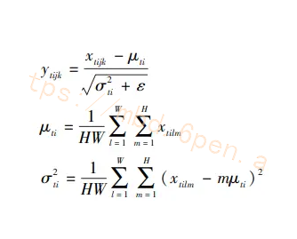

# 1.研究背景与意义


随着计算机技术的不断发展，图像处理领域也取得了长足的进步。其中，图像上色是一个重要的研究方向，它可以将黑白图像转化为彩色图像，使得图像更加真实、生动。图像上色在许多领域都有广泛的应用，比如电影、游戏、艺术创作等。然而，传统的图像上色方法往往需要人工干预，耗时且效果不佳。因此，研究基于改进CycleGAN＆pix2pix的黑白图像上色系统具有重要的意义。

首先，基于改进CycleGAN＆pix2pix的黑白图像上色系统可以提高图像上色的自动化程度。传统的图像上色方法通常需要人工干预，例如手动选择颜色、调整参数等。而基于改进CycleGAN＆pix2pix的系统可以通过学习大量的彩色图像和对应的黑白图像，自动学习到图像的颜色分布和特征，从而实现自动上色。这不仅可以节省人力成本，还可以提高上色的效率和准确性。

其次，基于改进CycleGAN＆pix2pix的黑白图像上色系统可以提供更好的上色效果。传统的图像上色方法往往存在一些问题，比如颜色失真、边缘模糊等。而基于改进CycleGAN＆pix2pix的系统可以通过深度学习的方法，学习到更准确的颜色分布和特征，从而提供更真实、生动的上色效果。这对于电影、游戏等领域的图像处理来说，具有重要的实际应用价值。

此外，基于改进CycleGAN＆pix2pix的黑白图像上色系统还可以为艺术创作提供更多的可能性。艺术家们常常使用黑白图像作为创作的基础，然后通过手工上色来增加图像的表现力和情感。而基于改进CycleGAN＆pix2pix的系统可以为艺术家们提供一个自动上色的工具，帮助他们更好地表达自己的创意和想法。这对于艺术创作的发展来说，具有重要的推动作用。

综上所述，基于改进CycleGAN＆pix2pix的黑白图像上色系统在图像处理领域具有重要的研究意义和实际应用价值。它可以提高图像上色的自动化程度，提供更好的上色效果，同时为艺术创作提供更多的可能性。相信随着深度学习技术的不断发展，基于改进CycleGAN＆pix2pix的系统将在未来取得更加广泛的应用和进一步的研究突破。

# 2.图片演示


# 3.视频演示
[基于改进CycleGAN＆pix2pix的黑白图像上色系统_哔哩哔哩_bilibili](https://www.bilibili.com/video/BV19w411q72T/?spm_id_from=333.999.0.0&vd_source=ff015de2d29cbe2a9cdbfa7064407a08)

# 4.模型框架
模型框架如图所示，采用双网络结构，包含记忆增强网络和着色网络。

图中，G为着色网络生成器;D为着色网络判别器;ResNet为预训练好的残差网络，用于提取图像信息。在训练过程中，记忆增强网络一方面存储训练集中彩色图像的空间特征、颜色特征等，另一方面学习如何高效地进行记忆查询，即快速检索与查询图像最匹配的颜色特征。着色网络生成器G则学习如何高效地将颜色特征注入灰度图像中，判别器D学习如何快速区分真实图像与生成图像。


# 5.核心代码讲解

#### 5.1 model.py

封装的类为ImageColorizationGAN，包含了生成器（Generator）、判别器（Discriminator）和组合模型（combined）的构建方法，以及生成彩色图像的方法（generate_colorized_images）。

```python

class Generator(nn.Module):
    def __init__(self, input_shape):
        super(Generator, self).__init__()
        self.conv1 = nn.Conv2d(input_shape[0], 64, kernel_size=4, stride=2, padding=1)
        self.conv2 = nn.Conv2d(64, 128, kernel_size=4, stride=2, padding=1)
        self.conv3 = nn.Conv2d(128, 256, kernel_size=4, stride=2, padding=1)
        # Add more layers as needed for your U-Net generator architecture

    def forward(self, x):
        x = self.conv1(x)
        x = nn.functional.relu(x)
        x = self.conv2(x)
        x = nn.functional.relu(x)
        x = self.conv3(x)
        x = nn.functional.relu(x)
        # Add forward pass for the rest of your generator layers
        return x

class Discriminator(nn.Module):
    def __init__(self, input_shape):
        super(Discriminator, self).__init__()
        self.conv1 = nn.Conv2d(input_shape[0], 64, kernel_size=4, stride=2, padding=1)
        self.conv2 = nn.Conv2d(64, 128, kernel_size=4, stride=2, padding=1)
        self.conv3 = nn.Conv2d(128, 256, kernel_size=4, stride=2, padding=1)
        # Add more layers as needed for your PatchGAN discriminator architecture
        self.fc = nn.Linear(final_size, 1)  # Define final_size correctly

    def forward(self, x):
        x = self.conv1(x)
        x = nn.functional.leaky_relu(x, negative_slope=0.2)
        x = self.conv2(x)
        x = nn.functional.leaky_relu(x, negative_slope=0.2)
        x = self.conv3(x)
        x = nn.functional.leaky_relu(x, negative_slope=0.2)
        # Add forward pass for the rest of your discriminator layers
        x = x.view(x.size(0), -1)
        x = self.fc(x)
        return x

class ImageColorizationGAN:
    def __init__(self, image_shape):
        self.image_shape = image_shape
        self.generator = self.build_generator()
        self.discriminator = self.build_discriminator()
        self.combined = self.build_combined()

    def build_generator(self):
        return Generator(self.image_shape)

    def build_discriminator(self):
        return Discriminator(self.image_shape)

    def build_combined(self):
        self.discriminator.trainable = False
        combined_model = nn.Sequential(self.generator, self.discriminator)
        return combined_model

        ......

```

该程序文件名为model.py，主要包含了三个类：Generator、Discriminator和ImageColorizationGAN。

Generator类是一个继承自nn.Module的模型，用于生成彩色图像。它包含了三个卷积层，分别是conv1、conv2和conv3，用于提取图像特征。在forward方法中，通过对输入数据进行卷积和激活函数操作，得到生成的图像。

Discriminator类也是一个继承自nn.Module的模型，用于判别图像的真实性。它也包含了三个卷积层，与Generator类相同，用于提取图像特征。在forward方法中，通过对输入数据进行卷积和LeakyReLU激活函数操作，得到判别结果。

ImageColorizationGAN类是一个用于图像着色的生成对抗网络。它包含了一个Generator和一个Discriminator，并且通过build_generator、build_discriminator和build_combined方法来构建这两个模型。在generate_colorized_images方法中，通过调用Generator的forward方法来生成彩色图像。

整个程序文件的目的是构建一个用于图像着色的生成对抗网络模型，其中Generator用于生成彩色图像，Discriminator用于判别图像的真实性，ImageColorizationGAN用于整合这两个模型，并提供生成彩色图像的功能。

#### 5.2 test.py

```python


class ImageTranslator:
    def __init__(self):
        self.opt = TestOptions().parse()  # get test options
        # hard-code some parameters for test
        self.opt.num_threads = 0   # test code only supports num_threads = 0
        self.opt.batch_size = 1    # test code only supports batch_size = 1
        self.opt.serial_batches = True  # disable data shuffling; comment this line if results on randomly chosen images are needed.
        self.opt.no_flip = True    # no flip; comment this line if results on flipped images are needed.
        self.opt.display_id = -1   # no visdom display; the test code saves the results to a HTML file.
        self.dataset = create_dataset(self.opt)  # create a dataset given opt.dataset_mode and other options
        self.model = create_model(self.opt)      # create a model given opt.model and other options
        self.model.setup(self.opt)               # regular setup: load and print networks; create schedulers

    def translate_images(self):
        # create a website
        web_dir = os.path.join(self.opt.results_dir, self.opt.name, '{}_{}'.format(self.opt.phase, self.opt.epoch))  # define the website directory
        if self.opt.load_iter > 0:  # load_iter is 0 by default
            web_dir = '{:s}_iter{:d}'.format(web_dir, self.opt.load_iter)
        print('creating web directory', web_dir)
        webpage = html.HTML(web_dir, 'Experiment = %s, Phase = %s, Epoch = %s' % (self.opt.name, self.opt.phase, self.opt.epoch))
        # test with eval mode. This only affects layers like batchnorm and dropout.
        # For [pix2pix]: we use batchnorm and dropout in the original pix2pix. You can experiment it with and without eval() mode.
        # For [CycleGAN]: It should not affect CycleGAN as CycleGAN uses instancenorm without dropout.
        if self.opt.eval:
            self.model.eval()
        for i, data in enumerate(self.dataset):
            if i >= self.opt.num_test:  # only apply our model to opt.num_test images.
                break
            self.model.set_input(data)  # unpack data from data loader
            self.model.test()           # run inference
            visuals = self.model.get_current_visuals()  # get image results
            img_path = self.model.get_image_paths()     # get image paths
            if i % 5 == 0:  # save images to an HTML file
                print('processing (%04d)-th image... %s' % (i, img_path))
            save_images(webpage, visuals, img_path, aspect_ratio=self.opt.aspect_ratio, width=self.opt.display_winsize, use_wandb=self.opt.use_wandb)
        webpage.save()  # save the HTML

if __name__ == '__main__':
    translator = ImageTranslator()
    translator.translate_images()
```

这是一个用于图像到图像转换的通用测试脚本。该脚本用于加载已保存的模型并将结果保存到指定目录。它首先根据选项创建模型和数据集，然后运行推理并将结果保存到一个HTML文件中。

该脚本的用法示例包括：
- 测试CycleGAN模型（双向转换）：`python test.py --dataroot ./datasets/maps --name maps_cyclegan --model cycle_gan`
- 测试CycleGAN模型（单向转换）：`python test.py --dataroot datasets/horse2zebra/testA --name horse2zebra_pretrained --model test --no_dropout`
- 测试pix2pix模型：`python test.py --dataroot ./datasets/facades --name facades_pix2pix --model pix2pix --direction BtoA`

该脚本还支持其他测试选项，可以参考`options/base_options.py`和`options/test_options.py`文件获取更多信息。

该脚本依赖于一些其他模块和库，如`options.test_options`、`data`、`models`、`util.visualizer`和`util.html`。如果缺少`wandb`库，会输出警告信息。

在`__main__`函数中，首先解析测试选项，然后硬编码一些测试参数。接着创建数据集和模型，并进行初始化设置。如果使用了`wandb`库，还会初始化日志记录器。然后创建一个网页目录，并根据选项设置模型的评估模式。最后，遍历数据集中的图像，对每张图像进行推理，并保存结果到HTML文件中。

总之，这个脚本用于加载模型并对图像进行测试，将结果保存到HTML文件中。

#### 5.3 train.py

```python


class ImageToImageTranslationTrainer:
    def __init__(self):
        self.opt = TrainOptions().parse()
        self.dataset = create_dataset(self.opt)
        self.dataset_size = len(self.dataset)
        self.model = create_model(self.opt)
        self.visualizer = Visualizer(self.opt)
        self.total_iters = 0

    def train(self):
        for epoch in range(self.opt.epoch_count, self.opt.n_epochs + self.opt.n_epochs_decay + 1):
            epoch_start_time = time.time()
            iter_data_time = time.time()
            epoch_iter = 0
            self.visualizer.reset()
            self.model.update_learning_rate()
            for i, data in enumerate(self.dataset):
                iter_start_time = time.time()
                if self.total_iters % self.opt.print_freq == 0:
                    t_data = iter_start_time - iter_data_time

                self.total_iters += self.opt.batch_size
                epoch_iter += self.opt.batch_size
                self.model.set_input(data)
                self.model.optimize_parameters()

                if self.total_iters % self.opt.display_freq == 0:
                    save_result = self.total_iters % self.opt.update_html_freq == 0
                    self.model.compute_visuals()
                    self.visualizer.display_current_results(self.model.get_current_visuals(), epoch, save_result)

                if self.total_iters % self.opt.print_freq == 0:
                    losses = self.model.get_current_losses()
                    t_comp = (time.time() - iter_start_time) / self.opt.batch_size
                    self.visualizer.print_current_losses(epoch, epoch_iter, losses, t_comp, t_data)
                    if self.opt.display_id > 0:
                        self.visualizer.plot_current_losses(epoch, float(epoch_iter) / self.dataset_size, losses)

                if self.total_iters % self.opt.save_latest_freq == 0:
                    print('saving the latest model (epoch %d, total_iters %d)' % (epoch, self.total_iters))
                    save_suffix = 'iter_%d' % self.total_iters if self.opt.save_by_iter else 'latest'
                    self.model.save_networks(save_suffix)

                iter_data_time = time.time()
            if epoch % self.opt.save_epoch_freq == 0:
                print('saving the model at the end of epoch %d, iters %d' % (epoch, self.total_iters))
                self.model.save_networks('latest')
                self.model.save_networks(epoch)

            print('End of epoch %d / %d \t Time Taken: %d sec' % (epoch, self.opt.n_epochs + self.opt.n_epochs_decay, time.time() - epoch_start_time))
            ......
```

这个程序文件是一个通用的用于图像到图像转换的训练脚本。它适用于不同的模型（使用选项'--model'，例如pix2pix、cyclegan、colorization）和不同的数据集（使用选项'--dataset_mode'，例如aligned、unaligned、single、colorization）。你需要指定数据集（'--dataroot'）、实验名称（'--name'）和模型（'--model'）。

它首先根据选项创建模型、数据集和可视化器。然后进行标准的网络训练。在训练过程中，它还会可视化/保存图像，打印/保存损失图表，并保存模型。该脚本支持继续/恢复训练。使用'--continue_train'来恢复之前的训练。


#### 5.4 data\aligned_dataset.py

```python

class AlignedDataset(BaseDataset):
    def __init__(self, opt):
        BaseDataset.__init__(self, opt)
        self.dir_AB = os.path.join(opt.dataroot, opt.phase)
        self.AB_paths = sorted(make_dataset(self.dir_AB, opt.max_dataset_size))
        assert(self.opt.load_size >= self.opt.crop_size)
        self.input_nc = self.opt.output_nc if self.opt.direction == 'BtoA' else self.opt.input_nc
        self.output_nc = self.opt.input_nc if self.opt.direction == 'BtoA' else self.opt.output_nc

    def __getitem__(self, index):
        AB_path = self.AB_paths[index]
        AB = Image.open(AB_path).convert('RGB')
        w, h = AB.size
        w2 = int(w / 2)
        A = AB.crop((0, 0, w2, h))
        B = AB.crop((w2, 0, w, h))
        transform_params = get_params(self.opt, A.size)
        A_transform = get_transform(self.opt, transform_params, grayscale=(self.input_nc == 1))
        B_transform = get_transform(self.opt, transform_params, grayscale=(self.output_nc == 1))
        A = A_transform(A)
        B = B_transform(B)
        return {'A': A, 'B': B, 'A_paths': AB_path, 'B_paths': AB_path}

    def __len__(self):
        return len(self.AB_paths)
```

这个程序文件是一个用于处理配对图像数据集的数据集类。它假设目录'/path/to/data/train'中包含以{A,B}形式的图像对。在测试时，需要准备一个目录'/path/to/data/test'。

这个类继承自BaseDataset类，并重写了其中的一些方法。在初始化方法中，它通过opt参数获取数据集的根目录和阶段，并将图像目录设置为根目录和阶段的组合。然后，它使用make_dataset函数获取图像路径，并对路径进行排序。接下来，它根据opt中的一些参数设置输入通道数和输出通道数。

在getitem方法中，它根据给定的索引读取一个图像，并将其分割为A和B两部分。然后，它应用相同的变换方法对A和B进行处理，并返回一个包含A、B、A_paths和B_paths的字典。

在len方法中，它返回数据集中图像的总数。

这个程序文件依赖于其他几个模块和类，如os、BaseDataset、get_params、get_transform、make_dataset和Image。

#### 5.5 data\base_dataset.py

```python


class BaseDataset(data.Dataset, ABC):
    def __init__(self, opt):
        self.opt = opt
        self.root = opt.dataroot

    @staticmethod
    def modify_commandline_options(parser, is_train):
        return parser

    @abstractmethod
    def __len__(self):
        return 0

    @abstractmethod
    def __getitem__(self, index):
        pass


def get_params(opt, size):
    w, h = size
    new_h = h
    new_w = w
    if opt.preprocess == 'resize_and_crop':
        new_h = new_w = opt.load_size
    elif opt.preprocess == 'scale_width_and_crop':
        new_w = opt.load_size
        new_h = opt.load_size * h // w

    x = random.randint(0, np.maximum(0, new_w - opt.crop_size))
    y = random.randint(0, np.maximum(0, new_h - opt.crop_size))

    flip = random.random() > 0.5

    return {'crop_pos': (x, y), 'flip': flip}


def get_transform(opt, params=None, grayscale=False, method=Image.BICUBIC, convert=True):
    transform_list = []
    if grayscale:
        transform_list.append(transforms.Grayscale(1))
    if 'resize' in opt.preprocess:
        osize = [opt.load_size, opt.load_size]
        transform_list.append(transforms.Resize(osize, method))
    elif 'scale_width' in opt.preprocess:
        transform_list.append(transforms.Lambda(lambda img: __scale_width(img, opt.load_size, opt.crop_size, method)))

    if 'crop' in opt.preprocess:
        if params is None:
            transform_list.append(transforms.RandomCrop(opt.crop_size))
        else:
            transform_list.append(transforms.Lambda(lambda img: __crop(img, params['crop_pos'], opt.crop_size)))

    if opt.preprocess == 'none':
        transform_list.append(transforms.Lambda(lambda img: __make_power_2(img, base=4, method=method)))

    if not opt.no_flip:
        if params is None:
            transform_list.append(transforms.RandomHorizontalFlip())
        elif params['flip']:
            transform_list.append(transforms.Lambda(lambda img: __flip(img, params['flip'])))

    if convert:
        transform_list += [transforms.ToTensor()]
        if grayscale:
            transform_list += [transforms.Normalize((0.5,), (0.5,))]
        else:
            transform_list += [transforms.Normalize((0.5, 0.5, 0.5), (0.5, 0.5, 0.5))]
    return transforms.Compose(transform_list)
```

这个程序文件是一个抽象基类（ABC）'BaseDataset'的实现，用于数据集。

它还包括常见的转换函数（例如，get_transform，__scale_width），可以在子类中使用。

这个类有以下几个函数需要实现：
- <__init__>: 初始化类，首先调用BaseDataset.__init__(self, opt)。
- <__len__>: 返回数据集的大小。
- <__getitem__>: 获取一个数据点。
- <modify_commandline_options>: （可选）添加特定于数据集的选项并设置默认选项。

这个类还定义了一些静态方法和辅助函数，用于数据预处理和转换。

# 6.系统整体结构

整体功能和构架概述：

该项目是一个基于改进CycleGAN＆pix2pix的黑白图像上色系统。它使用生成对抗网络（GAN）来实现将灰度图像转换为彩色图像的功能。项目包含了训练、测试和应用程序部分。

在训练部分，train.py文件用于训练模型。它根据选项指定的数据集和模型类型，创建相应的数据集对象和模型对象，并进行训练。训练过程中，会进行图像处理、损失计算、模型更新等操作，并保存训练好的模型。

在测试部分，test.py文件用于加载已保存的模型，并对图像进行转换。它根据选项指定的数据集和模型类型，创建相应的数据集对象和模型对象，并进行图像转换。转换结果会保存到HTML文件中。

在应用程序部分，ui.py文件实现了一个基于PyQt5的图形界面，用于用户交互。用户可以选择图像文件，然后点击按钮进行图像处理。处理结果会显示在界面上，并计算与原始图像之间的指标。

下面是每个文件的功能整理：

| 文件路径 | 功能 |
| -------- | ---- |
| model.py | 定义了生成器和判别器的模型类 |
| test.py | 测试脚本，加载模型并对图像进行转换 |
| train.py | 训练脚本，用于训练模型 |
| ui.py | 图形界面应用程序，用于用户交互 |
| data/aligned_dataset.py | 处理配对图像数据集的数据集类 |
| data/base_dataset.py | 数据集的抽象基类 |
| data/colorization_dataset.py | 处理着色图像数据集的数据集类 |
| data/image_folder.py | 处理图像文件夹数据集的数据集类 |
| data/single_dataset.py | 处理单个图像数据集的数据集类 |
| data/template_dataset.py | 数据集的模板类 |
| data/unaligned_dataset.py | 处理不配对图像数据集的数据集类 |
| data/__init__.py | 数据集模块的初始化文件 |
| datasets/combine_A_and_B.py | 将两个数据集合并为一个的脚本 |
| datasets/make_dataset_aligned.py | 创建配对图像数据集的脚本 |
| datasets/resize_pic.py | 调整图像大小的脚本 |
| models/base_model.py | 模型的抽象基类 |
| models/colorization_model.py | 着色模型的实现 |
| models/cycle_gan_model.py | CycleGAN模型的实现 |
| models/networks.py | 网络模型的实现 |
| models/pix2pix_model.py | pix2pix模型的实现 |
| models/template_model.py | 模型的模板类 |
| models/test_model.py | 测试模型的实现 |
| models/__init__.py | 模型模块的初始化文件 |
| options/base_options.py | 基础选项类，定义了通用的训练和测试选项 |
| options/test_options.py | 测试选项类，定义了测试时的选项 |
| options/train_options.py | 训练选项类，定义了训练时的选项 |
| options/__init__.py | 选项模块的初始化文件 |
| scripts/test_before_push.py | 在推送之前进行测试的脚本 |
| scripts/edges/batch_hed.py | 边缘检测的脚本 |
| scripts/eval_cityscapes/cityscapes.py | Cityscapes数据集的评估脚本 |
| scripts/eval_cityscapes/evaluate.py | Cityscapes数据集的评估脚本 |
| scripts/eval_cityscapes/util.py | Cityscapes数据集评估的辅助函数 |
| util/get_data.py | 获取数据的辅助函数 |
| util/html.py | HTML文件处理的辅助函数 |
| util/image_pool.py | 图像缓存池的实现 |
| util/util.py | 通用的辅助函数 |
| util/visualizer.py | 可视化工具类 |
| util/__init__.py | 工具模块的初始化文件 |

# 7.CycleGAN简介
Cycle-GAN是一个2017年推出的直击产业痛点的模型。众所周知，在一系列视觉问题上是很难以找到匹配的高质量图像作为target来供模型学习的，比如在超分辨领域内对于一个低分辨率的物体图像，未必能找到同样场景的高分辨率图像，这使得一系列深度学习模型的适应性有限。上述的困难总结起来就是：由于模型训练时必须依赖匹配的图像，而除非有目的的去产生这样的图像否则无法训练，并且很容易造成数据有偏。

Cycle-GAN训练的目的则避开了上述困难；该模型的思路是旨在形成一个由数据域A到数据域B的普适性映射，学习的目标是数据域A和B的风格之间的变换而非具体的数据a和b之间的一一映射关系。从这样的思路出发Cycle-GAN对于数据一一匹配的依赖性就不存在了，可以解决一系列问题，因此该模型的设计思路与具体做法十分值得学习。

总的来说，基于Cycle-GAN的模型具有较强的适应性，能够适应一系列的视觉问题场合，比如超分辨，风格变换，图像增强等等场合。

下面附一张匹配和非匹配图像的说明


通常的GAN的设计思路从信息流的角度出发是单向的，如下图所示：使用Generator从a产生一个假的b，然后使用Determinator判断这个假的b是否属于B集合，并将这个信息反馈至Generator,然后通过逐次分别提高Generator与Discriminator的能力以期达到使Generator能以假乱真的能力，这样的设计思路在一般有匹配图像的情况下是合理的。


# 8.pix2pix简介
给定一个输入数据和噪声数据生成目标图像，在pix2pix中判别器的输入是生成图像和源图像，而生成器的输入是源图像和随机噪声（使生成模型具有一定的随机性），pix2pix是通过在生成器的模型层加入Dropout来引入随机噪声，但是其带来输出内容的随机性并没有很大。同时在损失函数的使用上采用的是L1正则而非CGAN使用的L2正则用来使图像更清晰。

条件生成对抗网络为基础，用于图像翻译的通用模型框架。（图像翻译：将一个物体的图像表征转化为该物体的另一个表征，即找到两不同域的对应关系，从而实现图像的跨域转化）

（条件生成对抗网络：相较于传统GAN的生成内容仅由生成器参数和噪音来决定，CGAN中向生成器和判别器添加了一个条件信息y）

采用CNN卷积+BN+ReLU的模型结构

#### 生成器

以U-Net作为基础结构增加跳跃连接（下降通道256->64）压缩路径中每次为4*4的same卷积+BN+ReLU，根据是否降采样来控制卷积的步长。同时压缩路径和扩张路径使用的是拼接操作进行特征融合。


#### 判别器

传统GAN生成图像比较模糊（由于采用整图作为判别输入，pix2pix则分成N*N的Patch【大概将256的图N=7效果最好，但是N越大生成的图像质量越高1*1的被称为PixelGAN，不过一般自己调整感受野选择参数】）

# 9.改进CycleGAN

#### 批量归一化 BN
文中算法在CycleGAN基础上进行改进,原始的CycleGAN为了能够加快训练网络时的收敛速度以及归纳统一样本的统计分布性,采用批量归一化 BN (batchnormalization) 它能将数据强行归一化为均值为О、方差为1的正态分布上,这样有利于数据分布一致,也避免了梯度消失。BN的缺点也很明显,首先,它对样本的数量的大小比较敏感,因为每次计算的方差和均值都在一个批量上,所以如果批量太小,这会导致方差和均值不足以代表整个数据分布。其次BN只对固定深度的前向神经网络很方便。
基于此,文中采用了实例归一化IN(instance nor-malization)[1]替换 BN,这是因为在无监督上色中,输出图像主要依赖于某个图像实例,IN是对一个批次中单张图片进行归一化,而不是像BN对整批图片进行归一化然后提取平均值,所以IN更适合于无监督上色,提高输出图片上色的合理性和更好地保留底层信息,IN的计算公式如下:

其次,该算法还在生成器中引入了自注意力Self-Attention[3]机制,传统的生成对抗网络的问题表现在卷积核的大小选取上,小的卷积核很难发现图像中的依赖关系,但是大的卷积核又会降低卷积网络的计算效率。
为了提升上色效果,该算法将Self-Attention加载到生成器网络中,具体网络如图所示,即在前一层的特征图上加入 Self-Attention机制,使得生成对抗网络在生成时能区分不同的特征图。


#### 网络结构
在对图像彩色化的问题上,为了保持原图像的底层轮廓信息不变和上色的合理性,一般是采用 U-Net结构,如图所示,其好处是不需要所有的信息都通过生成器的所有层,这样就能使得输入和输出图像的底层信息和突出边缘位置信息能够被共享。 U-Net 型网络对于提升输出图像的细节起到了良好的效果。


# 10.系统整合

下图[完整源码＆数据集＆环境部署视频教程＆自定义UI界面](https://s.xiaocichang.com/s/6b559d)


参考博客[《基于改进CycleGAN＆pix2pix的黑白图像上色系统》](https://mbd.pub/o/qunshan/work)

# 11.参考文献
---
[1][商露兮](https://s.wanfangdata.com.cn/paper?q=%E4%BD%9C%E8%80%85:%22%E5%95%86%E9%9C%B2%E5%85%AE%22),[方建安](https://s.wanfangdata.com.cn/paper?q=%E4%BD%9C%E8%80%85:%22%E6%96%B9%E5%BB%BA%E5%AE%89%22),[谷小婧](https://s.wanfangdata.com.cn/paper?q=%E4%BD%9C%E8%80%85:%22%E8%B0%B7%E5%B0%8F%E5%A9%A7%22),等.[夜视图像自动彩色化源图选择算法](https://d.wanfangdata.com.cn/periodical/jgyhw200902029)[J].[激光与红外](https://sns.wanfangdata.com.cn/perio/jgyhw).2009,(2).DOI:10.3969/j.issn.1001-5078.2009.02.029 .

[2][孟敏](https://s.wanfangdata.com.cn/paper?q=%E4%BD%9C%E8%80%85:%22%E5%AD%9F%E6%95%8F%22),[刘利刚](https://s.wanfangdata.com.cn/paper?q=%E4%BD%9C%E8%80%85:%22%E5%88%98%E5%88%A9%E5%88%9A%22).[勾画式局部颜色迁移](https://d.wanfangdata.com.cn/periodical/jsjfzsjytxxxb200807003)[J].[计算机辅助设计与图形学学报](https://sns.wanfangdata.com.cn/perio/jsjfzsjytxxxb).2008,(7).

[3][李苏梅](https://s.wanfangdata.com.cn/paper?q=%E4%BD%9C%E8%80%85:%22%E6%9D%8E%E8%8B%8F%E6%A2%85%22),[韩国强](https://s.wanfangdata.com.cn/paper?q=%E4%BD%9C%E8%80%85:%22%E9%9F%A9%E5%9B%BD%E5%BC%BA%22).[基于K-均值聚类算法的图像区域分割方法](https://d.wanfangdata.com.cn/periodical/jsjgcyyy200816050)[J].[计算机工程与应用](https://sns.wanfangdata.com.cn/perio/jsjgcyyy).2008,(16).DOI:10.3778/j.issn.1002-8331.2008.16.050 .

[4][孙吉贵](https://s.wanfangdata.com.cn/paper?q=%E4%BD%9C%E8%80%85:%22%E5%AD%99%E5%90%89%E8%B4%B5%22),[刘杰](https://s.wanfangdata.com.cn/paper?q=%E4%BD%9C%E8%80%85:%22%E5%88%98%E6%9D%B0%22),[赵连宇](https://s.wanfangdata.com.cn/paper?q=%E4%BD%9C%E8%80%85:%22%E8%B5%B5%E8%BF%9E%E5%AE%87%22).[聚类算法研究](https://d.wanfangdata.com.cn/periodical/rjxb200801006)[J].[软件学报](https://sns.wanfangdata.com.cn/perio/rjxb).2008,(1).DOI:10.3724/SP.J.1001.2008.00048 .

[5][李建明](https://s.wanfangdata.com.cn/paper?q=%E4%BD%9C%E8%80%85:%22%E6%9D%8E%E5%BB%BA%E6%98%8E%22),[叶飞](https://s.wanfangdata.com.cn/paper?q=%E4%BD%9C%E8%80%85:%22%E5%8F%B6%E9%A3%9E%22),[于守秋](https://s.wanfangdata.com.cn/paper?q=%E4%BD%9C%E8%80%85:%22%E4%BA%8E%E5%AE%88%E7%A7%8B%22),等.[一种快速灰度图像彩色化算法](https://d.wanfangdata.com.cn/periodical/zgtxtxxb-a200703026)[J].[中国图象图形学报](https://sns.wanfangdata.com.cn/perio/zgtxtxxb-a).2007,(3).DOI:10.3969/j.issn.1006-8961.2007.03.026 .

[6][段立娟](https://s.wanfangdata.com.cn/paper?q=%E4%BD%9C%E8%80%85:%22%E6%AE%B5%E7%AB%8B%E5%A8%9F%22).[形状特征的编码描述研究综述](https://d.wanfangdata.com.cn/periodical/jsjkx200708059)[J].[计算机科学](https://sns.wanfangdata.com.cn/perio/jsjkx).2007,(8).DOI:10.3969/j.issn.1002-137X.2007.08.059 .

[7][王常亮](https://s.wanfangdata.com.cn/paper?q=%E4%BD%9C%E8%80%85:%22%E7%8E%8B%E5%B8%B8%E4%BA%AE%22).[基于聚类的自动颜色传输](https://d.wanfangdata.com.cn/periodical/jsjgcyyy200725020)[J].[计算机工程与应用](https://sns.wanfangdata.com.cn/perio/jsjgcyyy).2007,(25).DOI:10.3321/j.issn:1002-8331.2007.25.020 .

[8][朱为](https://s.wanfangdata.com.cn/paper?q=%E4%BD%9C%E8%80%85:%22%E6%9C%B1%E4%B8%BA%22),[李国辉](https://s.wanfangdata.com.cn/paper?q=%E4%BD%9C%E8%80%85:%22%E6%9D%8E%E5%9B%BD%E8%BE%89%22),[涂丹](https://s.wanfangdata.com.cn/paper?q=%E4%BD%9C%E8%80%85:%22%E6%B6%82%E4%B8%B9%22).[纹理合成技术在旧照片修补中的应用](https://d.wanfangdata.com.cn/periodical/jsjgcyyy200728067)[J].[计算机工程与应用](https://sns.wanfangdata.com.cn/perio/jsjgcyyy).2007,(28).DOI:10.3321/j.issn:1002-8331.2007.28.067 .

[9][赵源萌](https://s.wanfangdata.com.cn/paper?q=%E4%BD%9C%E8%80%85:%22%E8%B5%B5%E6%BA%90%E8%90%8C%22),[王岭雪](https://s.wanfangdata.com.cn/paper?q=%E4%BD%9C%E8%80%85:%22%E7%8E%8B%E5%B2%AD%E9%9B%AA%22),[金伟其](https://s.wanfangdata.com.cn/paper?q=%E4%BD%9C%E8%80%85:%22%E9%87%91%E4%BC%9F%E5%85%B6%22),等.[基于色彩传递的生物医学图像彩色化](https://d.wanfangdata.com.cn/periodical/smkxyq200711006)[J].[生命科学仪器](https://sns.wanfangdata.com.cn/perio/smkxyq).2007,(11).DOI:10.3969/j.issn.1671-7929.2007.11.006 .

[10][杨春玲](https://s.wanfangdata.com.cn/paper?q=%E4%BD%9C%E8%80%85:%22%E6%9D%A8%E6%98%A5%E7%8E%B2%22),[旷开智](https://s.wanfangdata.com.cn/paper?q=%E4%BD%9C%E8%80%85:%22%E6%97%B7%E5%BC%80%E6%99%BA%22),[陈冠豪](https://s.wanfangdata.com.cn/paper?q=%E4%BD%9C%E8%80%85:%22%E9%99%88%E5%86%A0%E8%B1%AA%22),等.[基于梯度的结构相似度的图像质量评价方法](https://d.wanfangdata.com.cn/periodical/hnlgdxxb200609005)[J].[华南理工大学学报（自然科学版）](https://sns.wanfangdata.com.cn/perio/hnlgdxxb).2006,(9).DOI:10.3321/j.issn:1000-565X.2006.09.005 .


---
#### 如果您需要更详细的【源码和环境部署教程】，除了通过【系统整合】小节的链接获取之外，还可以通过邮箱以下途径获取:
#### 1.请先在GitHub上为该项目点赞（Star），编辑一封邮件，附上点赞的截图、项目的中文描述概述（About）以及您的用途需求，发送到我们的邮箱
#### sharecode@yeah.net
#### 2.我们收到邮件后会定期根据邮件的接收顺序将【完整源码和环境部署教程】发送到您的邮箱。
#### 【免责声明】本文来源于用户投稿，如果侵犯任何第三方的合法权益，可通过邮箱联系删除。